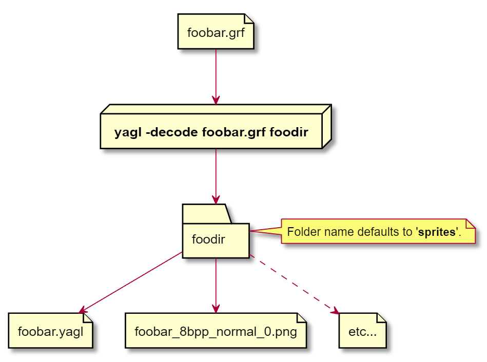
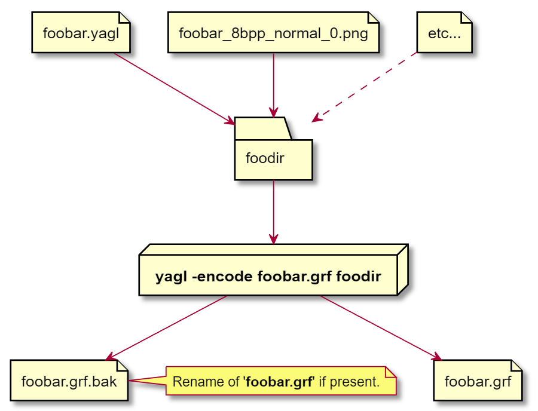

[Back to table of contents](index.md)

# Introduction

**yagl** is a command line tool, and a script language (called YAGL for maximal ambiguity), for working with OpenTTD and TTDPatch GRF files, as described in the [NewGRF specs](https://newgrf-specs.tt-wiki.net/wiki/Main_Page). It is basically a codec which performs either of the following operations:

1. Read a GRF file into memory, and then write out a YAGL script containing a textual representation of its contents, together with one or more sprite sheets (PNG format) containing the images present in the GRF. Sound effects are also written to files.



2. Read a YAGL file and any associated sprite sheets (and sound effects) into memory, and then write out a GRF file containing the binary representation of the YAGL and the encoded sprites which conforms to the NewGRF specs.



If you perform Step 1, and then perform Step 2 without first making any changes to the YAGL or the sprite sheets, then the re-generated GRF should in principle be identical to the original. There are a few valid reasons why there might be minor discrepancies: 
- The elimination of duplicate properties in Action00 records
- Re-ordering properties in Action00 records (the order is not significant)
- Variant unicode string encodings
- Possible variations in the way images are compressed
- And maybe some others...

Whatever the case may be, the before and after GRFs should should certainly be *semantically* identical. That is to say, they should be identical in operation as far as OpenTTD is concerned.

## Comparison with grfcodec and NFO

**grfcodec** is a long-established tool which, exactly like **yagl**, is for working with OpenTTD and TTDPatch GRF files, as described in the [NewGRF specs](https://newgrf-specs.tt-wiki.net/wiki/Main_Page).

**grfcodec** takes NFO files as input and converts them, along with sprite sheets, into GRF files. And vice versa.

A GRF file looks like a big opaque binary blob, but it has an internal structure. That structure is really quite simple: it is just a long list of "records". A record is a series of bytes which are interpreted by OpenTTD. Each record has a length, a type, and then a bunch of following bytes which form the content of the record and give it meaning. So far so dull...

An NFO file is more or less a direct representation of the bytes in each record in the GRF. An NFO file contains a long list of records, and each one directly corresponds to a single record in the GRF. For example, the following record was extracted from `WallyWebBridgeSet.nfo`. I've split the properties into rows to make them a little clearer:

```bash
   38 * 33	 00 06 0A 01 03 
             08 00 
             09 00 
             0A FF 
             0C 20 00 
             0E 01 
             0F 80 07 00 00 
             10 09 DC 
             11 0A DC 
             12 0B DC 
             13 14 00
```

This can be interpreted as follows:

- Record number 38 in the GRF/NFO. The number is not really significant for OpenTTD, but is necessary for **grfcodec**. Note this number is written in decimal.
- The record content length is 33 bytes. Note this number is written in decimal.
- Now come the content bytes. Note that the record number and length are written in decimal format, but that the content bytes are written in hexadecimal (base 16 format). Hex number are usually prefixed with '0x' to avoid any ambiguity. I'll do this below.
- The first content byte (0x00) indicates that this is an Action00 record (properties of some feature: Trains, Ships or whatever). 
- The second content byte (0x06) indicates that the feature in this case is Bridges.
- The third content byte (0x0A) indicates that the record contains information about 10 properties.
- The fourth content byte (0x01) indicates that the record contains that information for one bridge.
- The fifth content byte (0x03) indicates that the bridge for which the properties are being changed is Bridge #3 ('Suspension, Concrete Bridge' according to the docs). If there were more than one bridge, they would be #4, #5 and so on. Only the ID of the first one included.
- The sixth context byte (0x08) indicates the first property to be change. Property 0x08 is the year of availability. The value in the next byte is 0x00, which means 1920.

That's enough. You get the picture. It is quite difficult to read and understand NFO, and very easy to get wrong if you are writing it out to create a new GRF yourself. See [Bridges](https://newgrf-specs.tt-wiki.net/wiki/Action0/Bridges) for more details.

### And again with **yagl** and YAGL

A YAGL file also contains a long list of records, and each one directly corresponds to a single record in the GRF. For example, the following record is the YAGL version of the NFO record described above:

```bash
// Record #38
properties<Bridges, 0x0003> // Action00
{
    // instance_id: 0x0003
    {
        year_available: 0x00;
        minimum_length: 0x00;
        maximum_length: 0xFF;
        maximum_speed: 0x0020;
        various_flags: 0x01;
        long_year_available: 0x00000780;
        purchase_text: 0xDC09;
        description_rail: 0xDC0A;
        description_road: 0xDC0B;
        cost_factor_word: 0x0014;
    }
}
```

This can be interpreted as follows:

- The record number is 38. This is just a comment which **yagl** prints out to be helpful. It has no other signifance, and can be removed.
- The record type is 'properties'. This name was chosen as it seemed more meaningful than 'Action00', but it is arbitrary. There is another comment to indicate that it is Action00 anyway.
- The information in the angle brackets indicate that we are setting properties for Bridges, and that the ID of the first bridge is 3. Below this caption is a block delineated by braces. 
- The line with 'instance_id' repeats the ID of the bridge. This is a comment as it is really just documentation for the case where two or more bridges are having their properties changed.
- There is a sub-block for each instance (i.e. each bridge), which contains the names and values of the properties being changed.
- The first property is 'year_available', and is set to 0x00, which corresponds to 1920.
- And so on...

Note that any number can be written as decimal (e.g. 10), hexadecimal (0x0A), octal (012) or binary (0b1010). **yagl** reads all these formats interchangeably, and doesn't care which format you use. It just prints hex because this is the closest to NFO.

Also note that **yagl** prints hex with two, four or eight digits, depending on how big the underlying value is in the GRF (byte, word, double word). You are not required to split a value into bytes or use a special escape sequence as in NFO. Just write in the value you want. You are not required to include leading zeroes to make up the relevant number of digits. 

TODO I probably ought to check that values are not bigger than expected.

### Future improvements

The intention when creating YAGL was to directly match the contents of the GRF (or equivalent NFO) without any intervening complexity, but to make the information more human-readable. It should be possible to directly relate the contents of a YAGL record to the corresponding description in the the [NewGRF specs](https://newgrf-specs.tt-wiki.net/wiki/Main_Page). I believe this is an improvement on NFO, but there is a lot more that could still be done. For example: 

- Why not print '1920' for the year if that is what we mean? This is possible, but the interpretation of each property is different. And there are tons of different properties. I think this could be achieved piecemeal though: property by property. For now, it makes sense to write the hex value that should go in the GRF. 
- Some properties are bitfields, such as climate availability. In such cases, it would be better if the value was represented by named bits ORed together, such as `Tropical | Temperate`. 
- Some properties are enumerations. In such cases, it would be better is the values was represented by named enum values. This is like the bitfield example, but only a single value is allowed.

More and better error reporting is also desired.

## About the documentation

The main purpose of the documentation is to make a link between the YAGL text and the descriptions in the [NewGRF specs](https://newgrf-specs.tt-wiki.net/wiki/Main_Page). For example, there is an enumeration of names for the various feature types: Trains=0x00, Vehicles=0x01, Ships=0x02, Aircraft=0x03, Stations=0x04, and so on. There are many such enumerations in YAGL, and users can't really be expected to guess the permitted values. And there is a whole bunch of other things to explain.


